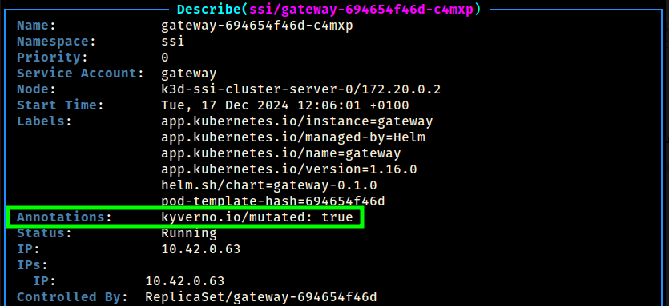

# Application Web Microservices avec Kubernetes & Helm


Ce projet consiste à déployer une application web composée de trois services dans un cluster Kubernetes local. Voici les spécifications du projet :

## Architecture de l'application

1. **Aggregator API (gateway)**  
   - Service principal exposé au public.  
   - Reçoit des requêtes HTTP et interagit avec les deux microservices suivants.  
   - Compose une phrase en combinant les réponses des microservices.

2. **Microservice Names**  
   - Génère des noms aléatoires.  

3. **Microservice Verbs**  
   - Génère des verbes aléatoires.  
   - Génère des adverbes aléatoires.

## Déploiement K3D 

1. Créer un cluster K3D avec 3 noeuds :  
```bash
k3d cluster create ssi-cluster 
```

2. vérifier que le bon contexte est sélectionné :  
```bash
kubectl config current-context
```

> **Note :** Les services seront déployés dans le namespace `ssi`.

3. Build des images Docker depuis le folder `microservices` :

Build `nonRootUser` et `rootUser` images :  
```bash
docker compose -f docker-compose.non-root-user.yaml -f docker-compose.root-user.yaml build
```

4. Importer les images `rootUser` et `nonRootUser` dans le cluster K3D :

Depuis le folder `kubernetes/scripts` :

```bash
chmod +x import-kd3-images.sh && ./import-kd3-images.sh
```

5. Déployer les services par default `rootUser` depuis le folder `kubernetes/helmfiles` :  

```bash
helmfile sync
```


6. Port-forwarding pour accéder à l'application :  
```bash
kubectl port-forward svc/gateway 3000:3000
# Ou "Shift+F" pour port-forwarding depuis K9S.
```
> **Note :** L'application est accessible à l'adresse `http://localhost:3000`

## Flow d'exécution des services

Le fichier `helmfile.yaml` décrit le déploiement ainsi l'ordre des services en utilisant des dépendances. À l'aide des propriétés `needs` et `wait` et `waitForJobs`, Helmfile assure que les services sont déployés dans l'ordre correct : Istio puis Kyverno avant de déployer NATS puis que NATS soit opérationnel avant de déployer les services `gateway`, `names-service` et `verbs-service`.

## Kyverno

### Kyverno integration

Pour s'assurer que Kyverno est prêt avant de déployer les services, un script bash [kyverno-ready.sh](./kubernetes/scripts/kyverno-ready.sh) est exécuté afin de vérifier l'état des `ClusterPolicies`. Le script est exécuté automatiquement par Helmfile à l'aide d'un hook `postsync`.


### Admission Policies 


1. Pod(s) require name label [manifests/require-name-label.yaml](./kubernetes/manifests/require-name-label.yaml)

Cette politique Kyverno assure que tous les pods déployés dans le cluster Kubernetes possèdent une étiquette spécifique `app.kubernetes.io/name:`. Elle exclut les namespaces kube-system et kyverno de cette vérification.

En cas de non respect de cette politique, un pod sera refusé par le contrôleur d'admission Kyverno.

**Reproduire l'erreur :** 

Pour reproduire les erreurs `require-label` , il suffit vous rendre dans le folder `kubernetes/helmfiles/values` puis de décommenter la ligne `kyverno.failed/name` dans un des fichier `gateway.yaml` et de relancer le déploiement avec `helmfile sync`.


---

2. Non root user in containers [manifests/require-run-as-non-root-user.yaml](./kubernetes/manifests/require-run-as-non-root-user.yaml)

Cette politique Kyverno assure que les conteneurs déployés dans le cluster Kubernetes n'utilisent pas l'utilisateur `root`. En cas de non respect de cette politique, un pod sera refusé par le contrôleur d'admission Kyverno.

**Reproduire l'erreur :** 

Pour reproduire les erreurs `run-as-non-root` , il suffit vous rendre dans le folder `kubernetes/helmfiles/values` puis de décommenter la ligne `runAsRoot: false` dans le fichier `gateway.yaml` et de relancer le déploiement avec `helmfile sync`. 


>**Important :** Si `runAsNonRoot` est défini sur `true` mais que le conteneur lui-même s'exécute en tant que ROOT, Kyverno ne pourra pas vérifier si le conteneur s'exécute correctement en tant que non-root. Cette vérification est effectuée par le contrôleur Kubernetes à l'aide de la politique de sécurité `SecurityContext`.


---

3. Vaildate resource limits (CPU, Memory) [manifests/require-resource-limits.admission.yaml](./kubernetes/manifests/require-resource-limits.admission.yaml)

Cette politique Kyverno assure que les conteneurs déployés dans le cluster Kubernetes ont des limites de ressources définies pour le CPU et la mémoire. En cas de non respect de cette politique, un pod sera refusé par le contrôleur d'admission Kyverno.

**Reproduire l'erreur :** 

Pour reproduire les erreurs `require-resource-limits` , il suffit vous rendre dans le folder `kubernetes/helmfiles/values` puis de décommenter la ligne `resources: {}` dans le fichier `gateway.yaml` et de relancer le déploiement avec `helmfile sync`. 


### Mutation Policies

#### !TODO: finish adding mutation policies

**Good practices :**
Chaque service 
`mutated` par Kyverno heritera par default de l'annotation `kyverno.io/mutated: "true"`. (See [mutate-security-context](./kubernetes/manifests/mutate-security-context.yaml))




## Falco 

### Default Falco Rules : quelques exemples

>**Notes :** Vous pouvez accéder aux rules de falco configurer par default depuis le service dans `etc/falco/falco_rules.yaml`.

1. **Detecting shell in container**  
   - Cette règle Falco détecte l'utilisation d'un shell dans un conteneur.  
   - Pour reproduire cette règle, vous pouvez exécuter un shell dans un conteneur en utilisant la commande `kubectl exec -it <pod-name> -- /bin/sh`.

Pour tester la règle, vous pouvez exécuter un shell dans un conteneur en utilisant la commande `kubectl exec -it <pod-name> -- /bin/sh`.

Puis vérifier depuis la WebUI de Falco si la règle a été déclenchée.


2. **Lecture de fichiers sensibles**
   - Cette règle Falco détecte la lecture de fichiers sensibles
   - Pour reproduire cette règle, vous pouvez exécuter la commande `cat /etc/shadow` dans un conteneur.
   


### Custom Falco Rules

Vous pouvez retrouver cette customes rules dans les values de falco dans le fichier `kubernetes/helmfiles/values/falco.yaml`.

> **Note :** De la même manière que les règles par default vous pouvez consulter les règles personnalisées dans le fichier `etc/falco/rules.d/do-not-write-etc.yaml`.


1. **Do not write to /etc**  
   - Cette règle Falco détecte l'écriture dans le répertoire `/etc`.  
   - Pour reproduire cette règle, vous pouvez exécuter la commande `touch /etc/<file-to-create>` dans un conteneur.


## Deployer le projet 

1. Run le deploiement : 
```bash
helmfile sync
```

2. Delete le deploiement : 
```bash
helmfile -l app=namespace-creator delete
```

## Commandes utiles HELMFILE

- **Lister les releases :**  
```bash
helmfile list
```

- **Deployer/Supprimer une release en particulier :**  
```bash
helmfile -l name=<release-name> <sync|delete>
```

- **Linter les erreurs dans les fichiers Helmfile :**  
```bash
helmfile lint
```          

- **Montrer les valeurs de configuration :**   
```bash
helm show values <chart-name>
```